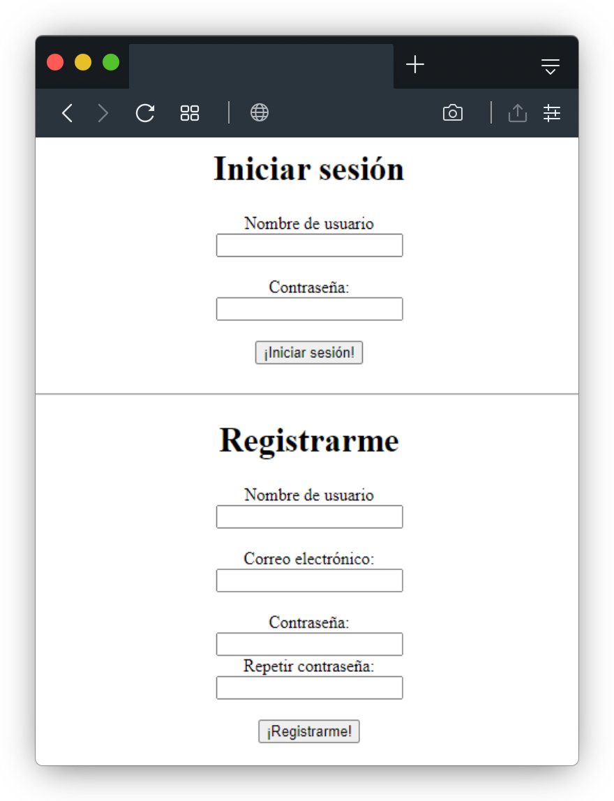

# Inicio de sesión básico
[](https://www.python.org/)
[](https://www.djangoproject.com/)

[](https://github.com/Marfullsen/simplest-sesion-django/tree/master/screenshots)

## ¿Qué es esto?
Es un sistema de gestión de credenciales, hecho de la manera **más simple posible**.

## ¿Cómo lo echo a andar?
- Primero instala Python3. [https://www.python.org/](https://www.python.org/)
- [Descarga](https://github.com/Marfullsen/simplest-sesion-django/archive/refs/heads/master.zip)/clona este repo. `git clone https://github.com/Marfullsen/simplest-sesion-django.git`
- Abre la carpeta y abre una terminal/consola/shell/prompt.
- Ejecuta estos comandos.
**Windows** 
```
python manage.py migrate
python manage.py runserver
```
**ó también**
```
py manage.py migrate
py manage.py runserver
```

- En el caso de **Linux**, Python **podría ya estar instalado**.
- Verificar que sea **Python3** pues ciertas distros traen Python2.

**Linux**
```
python3 manage.py migrate
python3 manage.py runserver
```

- Finalmente ve al sitio indicado **en la consola**.
    - **Posiblemente** [localhost:8000](http://localhost:8000/) ó [127.0.0.1:8000](http://127.0.0.1:8000/)

## ¿Qué incluye?
- Creación de usuario.
- Inicio de sesión.
- Cierre de sesión.

## ¿Necesito alguna base de datos en especial?
Por defecto se creará una base de datos **SQLite**.

## ¿Debo instalar SQLite?
No, Python incluye soporte para SQLite y lo gestionará sólo.

## Agradecimientos:
Al profe Julio :)
- [@DonTulio](https://github.com/DonTulio/)

## Recursos
- Creador de mockups de diversos navegadores:
    - [https://browserframe.com/](https://browserframe.com/)
